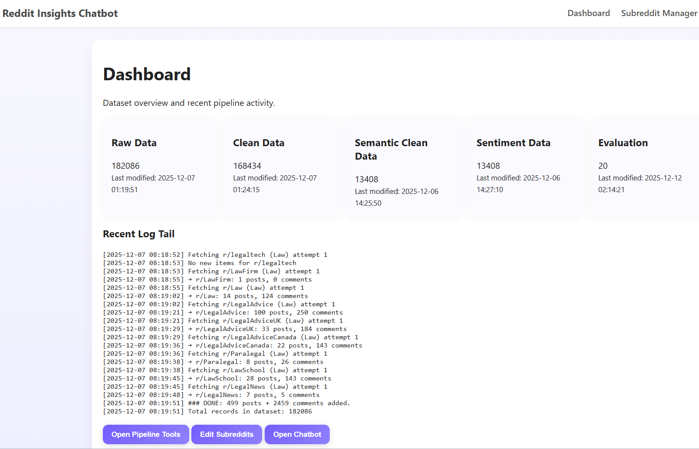

# Online Presence — Reddit Insights Chatbot with RAG
## MSDS 696 – Practicum II
## Jonish Bishwakarma

##  Introduction
This repository documents my journey building the Reddit Insights Chatbot, a project completed over two practicum courses (Practicum I and II). What started as a simple idea “summarize Reddit discussions about software tools” that turned into a full data pipeline, a retrieval-augmented chatbot, and eventually a cloud-deployed application.

I used this space to keep track of what I learned, why I made certain decisions, and how I handled the roadblocks that came up each week. My goal here is not to present a formal report, but to walk through my reasoning and thought process in a natural, honest way.

## How the Project Evolved Week by Week
This practicum project **Reddit Insights Chatbot with RAG** ended up being very different from what I expected when I started Week 1. What follows is a week-by-week walkthrough of what I did, why I made certain decisions, and what problems I ran into. I tried to write this the same way I would explain it to someone casually during office hours: straightforward, honest, and from my own perspective as the student building this system.
1. Week 1 — Finalizing the Project Idea
During the first week, my main goal was to crystalize what I was actually going to build. I already had a working RAG chatbot from Practicum I, but it was basically a prototype with a lot of rough edges. The idea this time was to turn it into a real automated system that could continuously collect Reddit data, clean it, classify it, index it, and generate high-quality RAG-based answers.
I drafted the proposal, and the biggest decision I made here was to keep the same industries **Law, Construction, and Tech** but rebuild the whole pipeline so it was cleaner and scalable. This provided a clear direction for the rest of the project.

2. Week 2 — Data Collection Automation
This week was all about rewriting the data collection script. My old scraper wasn’t reliable and didn't handle errors, so I focused on:
- making the script restart-safe,
- logging everything,
- handling API failures gracefully.

I also switched to a structure where subreddit lists came from `config/subreddits.json`, which made the tool more flexible. By the end of the week, I had a much more trustworthy data-collection step.

3. Week 3 — Incremental Indexing + Cron-Style Automation
I realized that reprocessing 100k+ Reddit posts every time was too expensive in terms of time and OpenAI usage. So this week, I built an incremental tracking system using a small SQLite DB.

The pipeline now knew:
- which posts were new,
- which posts were already cleaned,
- which posts were already indexed.

It reduced unnecessary processing and made the system feel more like something that could actually run periodically (like once a week) without breaking.

4. Week 4 — Subreddit Manager UI
This ended up taking more time than I thought. I built a browser-based UI where I could add, remove, or rename subreddits without touching the code.

This also helped me understand more clearly how messy real-world input pipelines can get. It seems small, but this part taught me about user-centered design—something I didn’t think much about before.

5. Week 5 — Deploying to the Cloud
Getting the chatbot online was more challenging than expected. Environment variables, Pinecone initialization, and template handling all required changes.
But once it worked, the whole project felt real and something I could actually show MSP Shift or anyone else.

6. Week 6 — Major RAG Retrieval Improvements
This week changed everything.
I discovered that more than 90% of the scraped Reddit posts were irrelevant, even after cleaning.
So I built a semantic filtering pipeline that used embeddings to classify posts into Law, Construction, and Tech.
This reduced tens of thousands of posts down to a focused dataset of useful content.

This was also the week I rewrote the retrieval logic:
- added hybrid search (semantic + similarity)
- removed noisy documents
- improved scoring
- created grounding rules
- switched from GPT-3.5-turbo → GPT-4o-mini
- switched from HuggingFace embeddings → OpenAI text-embedding-3-small
This was the biggest jump in answer quality and reduced hallucinations drastically.

7. Week 7 — Evaluation and Fine-Tuning
During Week 7, I focused entirely on evaluating the improvements. I built:
- the `evaluate.py` script,
- a hybrid retrieval function that mixes semantic + similarity search,
- a structured system prompt that always returns summary, key points, and subreddit evidence.
I also ran formal comparisons between:
- RAG answers vs plain LLM answers,
- relevance scores,
- grounding quality.

Most of the work this week was spent fixing things that were “almost correct.” For example, the retrieval cutoff thresholds, how many docs to include, or how to merge metadata into clean context windows.

This week made me appreciate how much fine-tuning matters for RAG systems.

8. Week 8 — Final Cleanup, Documentation, and Demo Prep

The last week was all about wrapping things up—writing documentation, cleaning the repo, structuring instructions, and generating analysis reports. I also produced the profiling report for the datasets and spent time improving the UI so that both the local and cloud versions looked consistent.

I added stronger formatting logic so the chatbot returns readable structured answers. I also wrote the README and organized all the code folders to match what a real-world project should look like.
This week didn’t involve much new coding, but it was crucial for making the project something I would feel comfortable showing to others.

---

## Major Issues & How I Solved Them
Throughout the project I ran into several roadblocks, and these ended up teaching me the most.
1. Too many irrelevant posts

Most Reddit posts had nothing to do with software tools.
I solved this by adding embedding-based semantic categorization before sentiment and indexing. This reduced noise massively.

2. Pinecone instability

Sometimes the index failed to connect or had missing vectors.
I rewrote the indexing script with safer upsert behavior and fewer assumptions about the index state.

3. RAG hallucinations

The chatbot would confidently answer questions that had no ground truth in context.
I enforced strict grounding rules and rebuilt the system prompt so it must answer “I don’t know…” when evidence is weak.

4. High API cost

Using HuggingFace models locally was slow, and OpenAI embeddings across 190k rows was too expensive.
I solved this by filtering the dataset first, then embedding only the refined rows.

5. Render deployment differences

Render behaves differently from local development.
I had to build a minimized version of the app for Render that still used the exact same RAG logic but avoided heavy pipeline tasks.

---

## What I Learned Through the Process
The biggest lesson was that data engineering matters more than modeling.
The model only performs as well as the retrieval system feeding it good context. I also learned:

- Embeddings and indexing strategy dramatically affect RAG quality.
- Automation saves time and money.
- UI matters — it helps demonstrate the idea to non-technical users.
- Evaluation forces you to face weaknesses you normally wouldn’t see.

In short, this project was not about building a fancy chatbot, it was about learning how to build a complete, end-to-end system that could run in the real world.
More importantly, I learned how to break a big messy project into smaller pieces and improve them one by one without losing the big picture.

---

## Closing Thoughts
This GitHub repository is the complete home for my work on the Reddit Insights Chatbot.
It documents not just the code, but the reasoning, decisions, iterations, and obstacles that shaped the final outcome.

I built something I’m genuinely proud of — a system that collects real-world user feedback, cleans and organizes it, and turns it into meaningful insights through a reliable, grounded RAG chatbot.

If you want to explore the project, the full code, pipeline scripts, dataset outputs, evaluation results, and Render deployment files are included here.

Thank you for checking out my work!

## Visual Summary

> **Dashboard and recent pipeline overview**

  

---

## Acknowledgements

- **Professor Christy Pearson**, for mentorship and continuous feedback  
- **MSP Shift**, for providing the real-world context and initial project vision  
- **LangChain**, **Pinecone**, **HuggingFace**, and **OpenAI**, for the powerful open-source tools that made this project possible  

---

